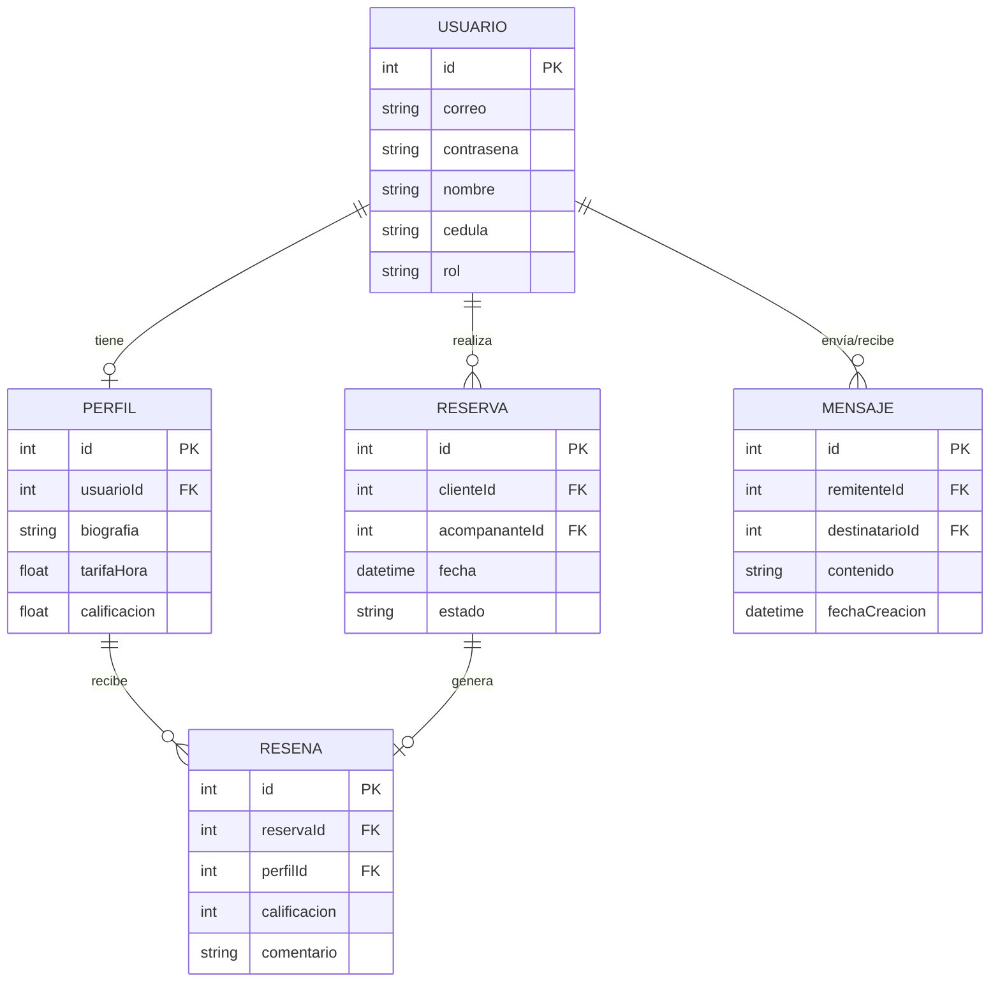
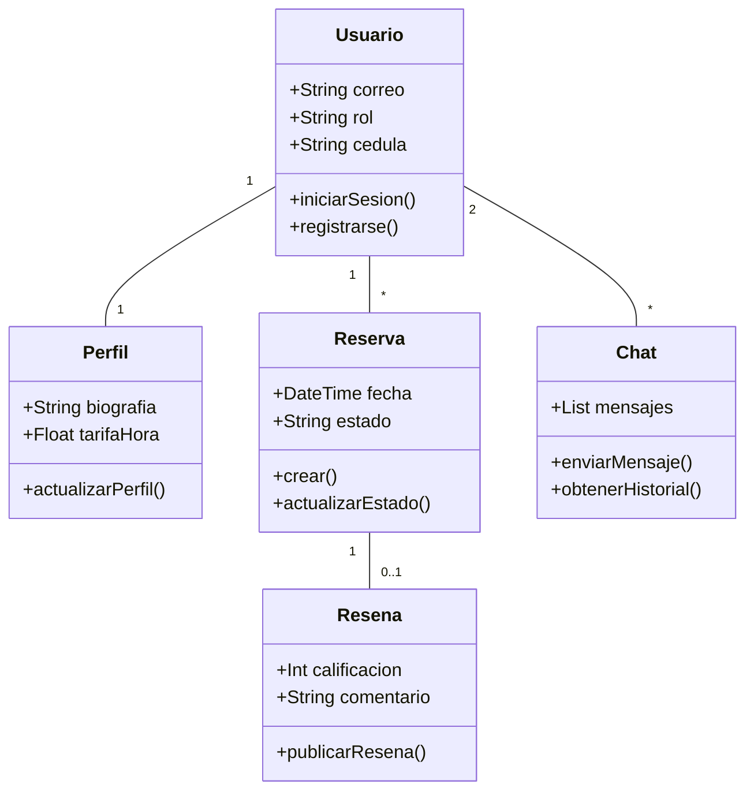

# Documentación Técnica: RentCompanion

## 1. Título del Proyecto
**RentCompanion**: Sistema Integral de Gestión y Reserva de Acompañamiento Social.

---

## 2. Resumen
RentCompanion es una plataforma web de vanguardia diseñada para digitalizar y formalizar los servicios de acompañamiento social. El sistema permite a los usuarios registrarse bajo roles específicos (Cliente o Acompañante), gestionar perfiles profesionales, realizar reservas mediante un sistema de estados (aprobación/finalización) y comunicarse de forma segura. La aplicación destaca por su enfoque en la privacidad, bloqueando las comunicaciones una vez terminado el servicio, y por su robustez técnica al emplear una base de datos relacional local que garantiza la integridad de los datos.

---

## 3. Desarrollo: Documento de Requerimientos

### 3.1 Requerimientos Funcionales (Perspectiva del Cliente)
*   **RF1 - Registro de Cuenta**: El sistema permitirá a nuevos usuarios crear una cuenta especificando su rol y validando que el correo electrónico no esté duplicado.
*   **RF2 - Gestión de Sesiones**: Autenticación segura mediante cookies cifradas para mantener la sesión activa entre diferentes páginas.
*   **RF3 - Catálogo Dinámico**: Visualización de una lista actualizada de acompañantes con capacidad de ver detalles individuales como biografía y tarifa.
*   **RF4 - Solicitud de Citas**: Interfaz para seleccionar fecha y hora, creando una reserva en estado "Pendiente".
*   **RF5 - Gestión de Historial**: El usuario podrá visualizar sus reservas pasadas y actuales, con la opción de eliminar registros cancelados o finalizados.
*   **RF6 - Comunicación Restringida**: Acceso a un chat privado únicamente cuando existe una reserva en estado "Aprobada".
*   **RF7 - Sistema de Calificaciones**: Tras la finalización de una cita, el cliente podrá otorgar una puntuación (1-5 estrellas) y un comentario que afectará el promedio del acompañante.

### 3.2 Requerimientos No Funcionales
*   **Seguridad**: Todas las contraseñas se almacenan cifradas mediante el algoritmo **BCrypt**.
*   **Persistencia**: Los datos se almacenan en un archivo local SQLite, evitando la dependencia de servidores en la nube.
*   **Interfaz de Usuario**: Diseño responsivo compatible con dispositivos móviles y escritorio, con una estética de "Modo Oscuro" (Negro y Rojo).
*   **Rendimiento**: Generación de páginas estáticas y dinámicas mediante Next.js para asegurar tiempos de carga menores a 2 segundos.

---

## 4. Simulación de Etapas

### 4.1 Análisis y Diseño

#### Arquitectura del Sistema
Se seleccionó la arquitectura de **Next.js 14+ con App Router** por su capacidad de manejar lógica de servidor (*Server Actions*) y cliente de forma unificada. Para el manejo de datos, se empleó **Prisma ORM**, lo que permite interactuar con la base de datos SQLite mediante objetos de JavaScript, reduciendo errores de sintaxis SQL.

#### Diseño de Interfaz (UI/UX)
El diseño se centró en la legibilidad y la exclusividad. Se utilizó una paleta de colores basada en el negro profundo (`#0a0a0a`) y acentos en rojo vibrante (`#ff4d4d`) para resaltar botones de acción y estados críticos.

---

### 4.2 Fase de Ejecución (Detalle Paso a Paso)

#### Paso 1: Configuración del Entorno y Modelo de Datos
Se inicializó el proyecto y se definió el archivo `schema.prisma`. Este paso es crítico ya que define la estructura relacional. Se crearon 5 modelos principales: `User`, `Profile`, `Booking`, `Message` y `Review`, estableciendo relaciones de "uno a muchos" entre usuarios y sus actividades.

#### Paso 2: Implementación de la Lógica de Autenticación
Se desarrollaron las funciones de cifrado y descifrado de tokens JWT. Se implementó una lógica de protección donde cada página verifica la cookie de sesión antes de renderizarse. El registro se configuró para crear automáticamente un perfil vacío para los usuarios que eligen el rol de "Acompañante".

#### Paso 3: Desarrollo del Motor de Reservas y Chat
Se creó un sistema de estados para las reservas: `PENDING` -> `APPROVED` -> `COMPLETED`. 
*   La lógica del chat incluye un "middleware" lógico: antes de permitir el envío de un mensaje, el sistema consulta la base de datos para confirmar que existe una reserva `APPROVED` entre esos dos usuarios específicos. Si no existe, el componente de chat se desactiva.

#### Paso 4: Sistema de Reseñas y Promedios
Se implementó un activador (*trigger*) lógico en la acción de calificar. Cada vez que un cliente envía una reseña, el sistema calcula el promedio de todas las estrellas recibidas por ese acompañante y actualiza su perfil en tiempo real, asegurando que la reputación siempre sea exacta.

#### Paso 5: Optimización de Base de Datos y Limpieza
Se añadió la funcionalidad de eliminación en cascada. Al eliminar una reserva del historial, el sistema limpia automáticamente cualquier dato huérfano asociado para mantener el archivo `dev.db` optimizado y ligero.

---

## 5. Conclusión
El proyecto **RentCompanion** cumple con todos los objetivos académicos planteados, integrando tecnologías de última generación para resolver un problema de gestión social. La separación de responsabilidades entre el frontend y el backend, sumada a una base de datos relacional bien estructurada, garantiza que la aplicación sea escalable y fácil de mantener. El resultado es una herramienta funcional, segura y estéticamente atractiva.

---

## 6. Despliegue y Mantenimiento
Para desplegar el sistema en un entorno de evaluación:
1.  **Instalación**: Ejecutar `npm install` para descargar las dependencias.
2.  **Sincronización**: Utilizar `npx prisma db push` para mapear el esquema a la base de datos física.
3.  **Ejecución**: Lanzar el comando `npm run dev`.
4.  **Monitoreo**: Se recomienda el uso de `npx prisma studio` para auditorías visuales de los datos en tiempo real.

---

## 7. Anexos: Diagramas Técnicos (Formato Mermaid)

### 7.1 Diagrama de Entidad-Relación (Base de Datos)

### 7.2 Diagrama de Clases (Arquitectura de Software)

